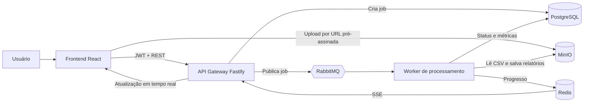

# FluxoCSV

Aplicação full stack para transformar arquivos CSV de vendas em relatórios prontos para decisão. O upload não bloqueia a interface: o arquivo é armazenado, enfileirado e processado por workers em segundo plano, com acompanhamento de status em tempo real.

<p>
  
  
  
  
  
  
  
  
</p>

## Visão geral

O FluxoCSV resolve um cenário comum em produtos orientados a dados: o usuário precisa enviar um arquivo potencialmente grande, mas não deve esperar o processamento terminar para continuar usando a aplicação. A solução separa upload, processamento e geração de relatórios em etapas desacopladas.

Na prática, o usuário envia um CSV, acompanha o status do job e baixa um resumo consolidado em CSV ou um relatório visual em HTML ao final da execução.

## Arquitetura



| Componente | Responsabilidade |
| --- | --- |
| **React + Vite** | Interface de autenticação, upload, acompanhamento de jobs e download de relatórios. |
| **Fastify** | API pública, autenticação JWT, URLs pré-assinadas, criação de jobs e canal SSE. |
| **RabbitMQ** | Desacopla a criação do job do processamento e mantém a fila de trabalho. |
| **Worker Node.js** | Consome jobs, valida o CSV, calcula indicadores e gera os relatórios. |
| **Redis** | Armazena e publica o progresso temporário de cada job. |
| **PostgreSQL + Prisma** | Persiste usuários, jobs, resultados agregados e metadados dos arquivos. |
| **MinIO** | Armazena o CSV original e os relatórios CSV/HTML gerados. |

## Fluxo de processamento

1. O frontend solicita à API uma URL pré-assinada para o arquivo CSV.
2. O navegador envia o arquivo diretamente ao MinIO, sem sobrecarregar a API.
3. Após o upload, a API cria um job no PostgreSQL e publica sua referência no RabbitMQ.
4. Um worker consome a mensagem, lê o arquivo, valida campos e calcula faturamento, ticket médio, quantidade de itens e ranking de produtos.
5. O worker publica o progresso no Redis e grava o resultado consolidado no PostgreSQL.
6. Os relatórios CSV e HTML são salvos no MinIO; o job passa para `completed` ou `failed`.
7. A API transmite os eventos de progresso ao frontend via Server-Sent Events (SSE), que então libera os downloads.

## Funcionalidades

- Cadastro e login com JWT.
- Jobs e relatórios isolados por usuário.
- Upload de arquivos CSV de até 100 MB por URL pré-assinada.
- Processamento assíncrono com fila RabbitMQ e worker independente.
- Progresso em tempo real com SSE.
- Validação de colunas e identificação de registros inválidos.
- Cálculo de faturamento total, ticket médio, itens vendidos e produtos mais rentáveis.
- Download de resumo em CSV e relatório visual em HTML.

## Como executar localmente

### Pré-requisitos

- [Docker Desktop](https://www.docker.com/products/docker-desktop/) em execução.
- Portas `3000`, `5173`, `5432`, `5672`, `6379`, `9000`, `9001` e `15672` disponíveis.

Na raiz do projeto, execute:

```bash
docker compose up --build
```

Depois, acesse `http://localhost:5173`, crie uma conta e envie um arquivo CSV. Para encerrar os serviços, use `docker compose down`.

### Serviços locais

| Serviço | Endereço | Credenciais de desenvolvimento |
| --- | --- | --- |
| Frontend | `http://localhost:5173` | Crie uma conta pela interface. |
| API | `http://localhost:3000/health` | — |
| MinIO Console | `http://localhost:9001` | `fluxocsv` / `fluxocsv_dev_secret` |
| RabbitMQ Management | `http://localhost:15672` | `fluxocsv` / `fluxocsv_dev` |
| PostgreSQL | `localhost:5432` | `fluxocsv` / `fluxocsv_dev` |

## Formato de CSV aceito

O arquivo deve conter uma coluna de produto e uma de valor. A quantidade é opcional. O parser aceita campos separados por vírgula ou ponto e vírgula, além de valores decimais nos formatos brasileiro e internacional.

```csv
produto,quantidade,valor
Caderno universitário,2,29.90
Caneta azul,4,9.50
```

| Tipo de dado | Nomes de coluna reconhecidos |
| --- | --- |
| Produto | `produto`, `product`, `item`, `descricao`, `nome` |
| Valor | `valor`, `preço`, `receita`, `venda`, `total`, `amount` |
| Quantidade (opcional) | `quantidade`, `qtd`, `quantity`, `unidades` |

Linhas sem produto ou com valor inválido/zero são ignoradas durante a agregação e contabilizadas no relatório de qualidade dos dados.

## Decisões técnicas

- **Upload direto ao storage:** URLs pré-assinadas evitam que arquivos grandes trafeguem pela API, reduzindo consumo de memória e facilitando escalabilidade horizontal.
- **Mensageria no processamento:** RabbitMQ permite que o upload responda rapidamente e que workers sejam escalados sem acoplamento ao frontend.
- **Estado transitório no Redis:** progresso é efêmero e publicado como evento; resultados permanentes ficam no PostgreSQL.
- **SSE para atualizações:** o caso de uso é unidirecional — servidor para cliente — e SSE reduz a complexidade operacional em comparação a WebSockets.
- **Relatórios no MinIO:** arquivos binários permanecem fora do banco relacional; o PostgreSQL mantém somente metadados e resultados analíticos.

## Próximos passos

- Adicionar testes de integração para o fluxo completo com infraestrutura real.
- Criar observabilidade com logs estruturados, métricas e tracing distribuído.
- Implantar autenticação por provedor externo e rotação de segredos fora do ambiente local.
- Evoluir o worker para leitura totalmente incremental de arquivos muito maiores.
- Disponibilizar relatório em PDF e filtros analíticos por período ou produto.
